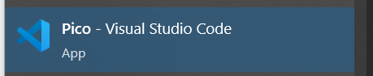

# ScienceCamp Version of TS-UNB

**See below for original README!**


## Preparation (Windows)

1. Install Pico SDK with VS Code version (see: https://www.raspberrypi.com/news/raspberry-pi-pico-windows-installer/)

2. In the project folder `examples` create a file `.env` that contains the Mioty settings for the device as follows:

```
MAC_NETWORK_KEY="0x00 ..."
MAC_EUI64="0x00..."
MAC_SHORT_ADDR="0x00 ..."
```

## How to build (Windows)

1. Open the Pico SDK enabled VS Code. For Windows the Start Menu entry looks like this:
   
2. Open this project folder - CMake shall automatically start the configuration
3. Build the "sendString.cpp" example

## How to run (Windows)

1. Connect the Pico via Micro-USB to the Computer while holding down the white button
2. The device shall show up as drive
3. Copy the file `examples/build/sendString.uf2` to the drive
4. The Pico will restart and run the program

*** 
**ORIGINAL README:**

# TS-UNB 

Welcome to TS-UNB-Lib. It implements the standard ETSI TS 103 357 TS-UNB.  
The purpose of this TS-UNB-Lib is academic and non-commercial use. Therefore, Fraunhofer does
not offer any support for the TS-UNB-Lib. Furthermore, the TS-UNB-Lib is NOT identical and on 
the same quality level as the commercially-licensed MIOTY software also available from Fraunhofer.
Users are encouraged to check the Fraunhofer website for additional applications information and documentation.


## Supported Devices

This library supports the devices listet below. The list of devices will be extended in the future.
### Systems
* Raspberry Pi Pico using the RP2040 Chip; 


### Transceiver Chipsets
* HopeRF RFM69w
* HopeRF RFM69hw


## License
See the file [LICENSE.md](LICENSE.md) for details on the software license for this library.

## Installation
Please set up the Pico-SDK and try the example.

